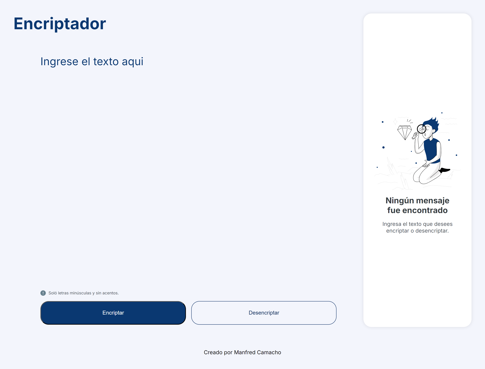
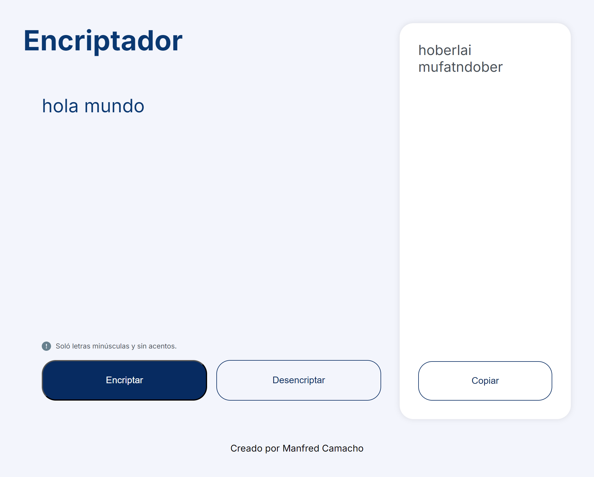
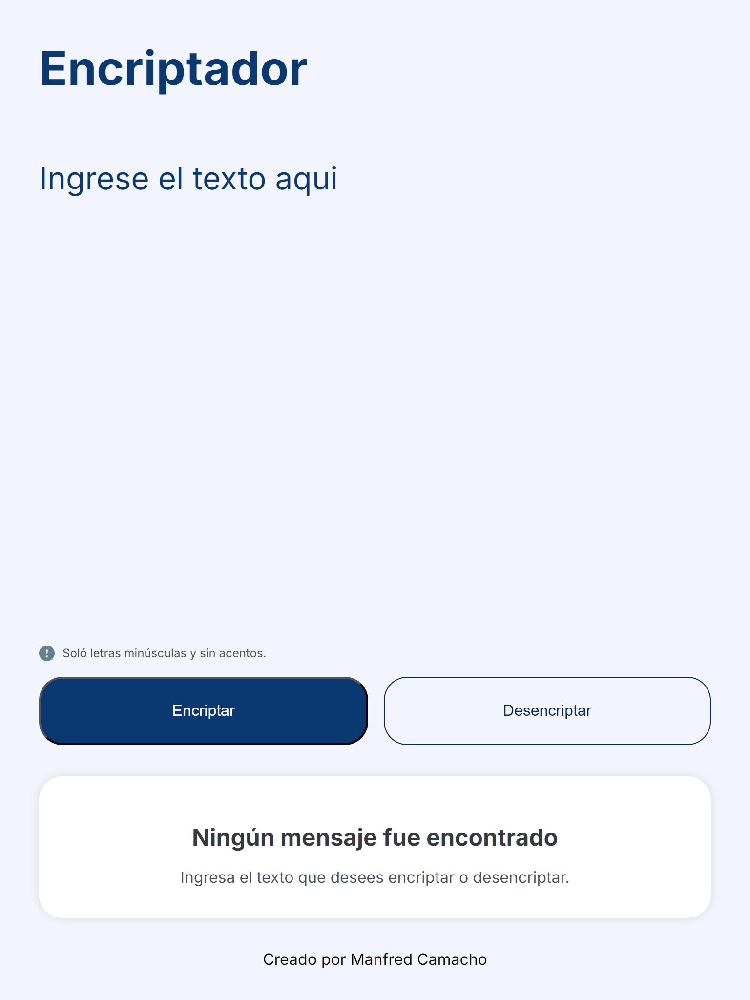
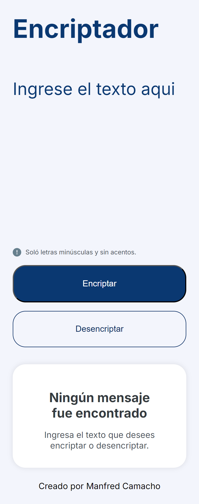

# Message Encryptor

## Description

This project is a web application that allows you to encrypt and decrypt text messages. It was developed using HTML, CSS, and JavaScript, featuring a responsive interface.

## Preview

### Desktop
<center></center>

<center></center>

### Tablet
<center></center>

### Mobile
<center></center>

## Features

- **Message Encryption:** Converts plain text into encrypted text.
- **Message Decryption:** Converts encrypted text back into plain text.
- **Text Validation:** Only allows lowercase letters without accents.
- **User-friendly and Responsive Interface:** Designed for use on any device.
- **Copy Encrypted Message:** Allows you to copy the encrypted text to the clipboard.

## Project Structure

The project is organized as follows:

```
message-encryptor/
├── index.html
├── css/
│   └── styles.css
├── img/
│   └── illustration.svg
└── js/
    └── app.js
```

### `index.html`

Contains the main structure of the web application. Includes the form to input text, encrypt and decrypt buttons, and a section to display the encrypted message.

### `css/styles.css`

Defines the styles of the application, including colors, fonts, and responsive design. Uses CSS variables to manage colors and fonts.

### `img/illustration.svg`

Image used in the interface to illustrate when there are no messages.

### `js/app.js`

Contains the logic for encrypting and decrypting messages. Adds functionality to the buttons and handles text input validation.

## How to Run the Project

1. **Clone the repository:**

   ```bash
   git clone https://github.com/manfredcamacho/encriptador-challenge.git
   ```

2. **Navigate to the project directory:**

   ```bash
   cd encriptador-challenge
   ```

3. **Open the `index.html` file in a web browser:**

   You can double-click the `index.html` file or open it directly from your preferred browser.

## Technologies Used

- **HTML5:** For the structure of the page.
- **CSS3:** For styles and responsive design.
- **JavaScript:** For the encryption and decryption logic.
